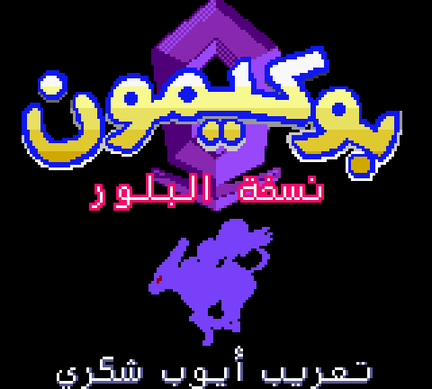
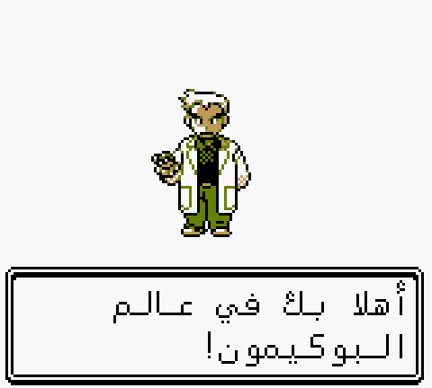
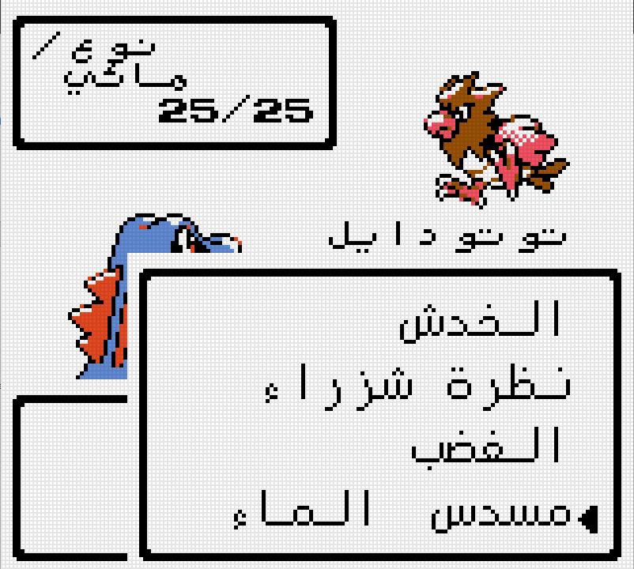
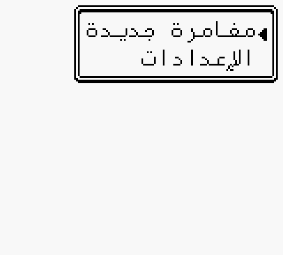
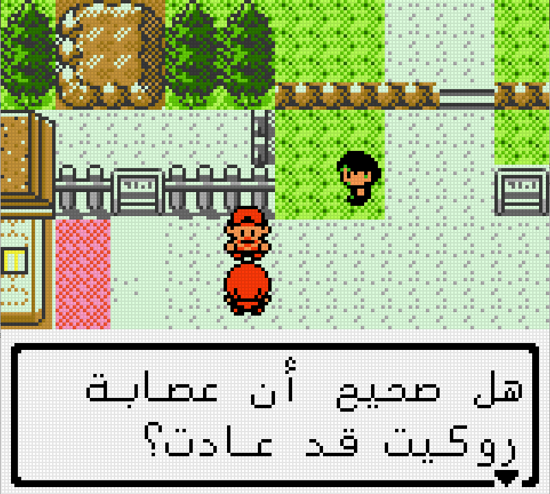
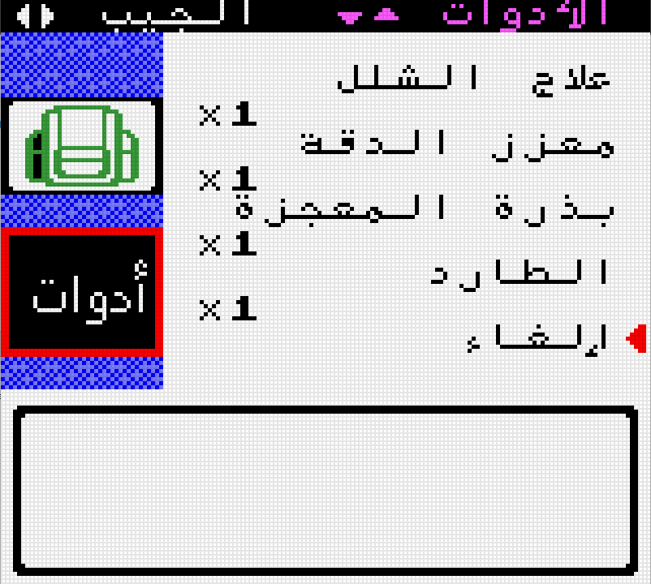
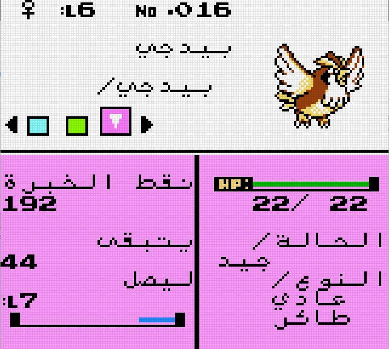

# Pokémon Crystal — Arabic

### بوكيمون نسخة البلور — الترجمة العربية

Pokémon Crystal, in Arabic. Every line the game can show you — dialogue, menus,
battle text, item and move names, Pokédex entries, the trainer card, phone
calls, the Battle Tower — reads right to left, in Arabic script, with the
letters joined.

That last part is why this took a renderer rather than a font. The game draws
one 8×8 tile per character, left to right. Arabic reads the other way, each
letter changes shape depending on its neighbours, and eight pixels of height is
not enough to stay legible. So the hack carries its own text engine: a
right-to-left, shaping-aware **8×16 renderer** that runs alongside the original
8×8 one and borrows VRAM from the walking-sprite pool a glyph at a time.

> **No ROM is included here.** You supply your own copy of Pokémon Crystal. The
> download is a *patch* — a list of differences — and it does nothing without
> the original game.

  
  

  
  
  
  
  

---

## Playing it

**1. Get the patch.** `pokecrystal-arabic.bps`, from the
[latest release][releases].

**2. Get your ROM.** Pokémon Crystal **(UE) v1.0**, from your own cartridge or
your own backup:

| | |
|---|---|
| File | `Pokemon - Crystal Version (UE) (V1.0) [C][!].gbc` |
| Size | 2,097,152 bytes (2 MiB) |
| SHA-1 | `f4cd194bdee0d04ca4eac29e09b8e4e9d818c133` |

Any other revision — v1.1, the Australian release, the debug builds — is
**rejected**. BPS stores a checksum of the ROM it expects, so the wrong base
gives you an error instead of a quietly broken game.

**3. Apply it.**

- [Floating IPS (Flips)][flips] — Windows, macOS, Linux
- [RomPatcher.js][rompatcher] — runs in your browser, nothing to install
- `flips --apply pokecrystal-arabic.bps your-crystal.gbc crystal-arabic.gbc`

A correct result has SHA-1 `a6bd086c89361224a9dd45e0fa2a13510f11e148`.

**4. Play it** on anything accurate: [mGBA][mgba], [BGB][bgb], SameBoy, an
Analogue Pocket, or a flashcart on real hardware.

> **Game Boy Color only.** The tall font needs CGB's second VRAM bank and its
> per-tile attributes. On original DMG hardware, or an emulator forced into DMG
> mode, the Arabic will not render.

---

## Found something?

[Open an issue][issues] — a screenshot and roughly where you were is plenty.
Text that overruns its box, a letter in the wrong form, a line that reads
awkwardly: all worth reporting, including the last one. Translation notes are
as welcome as bugs.

---

## Credits

Built on [pret/pokecrystal][pokecrystal], the disassembly that makes any of
this possible.

Pokémon Crystal is © Nintendo / Creatures / GAME FREAK. This is an unofficial
fan translation, not affiliated with or endorsed by them.

[pokecrystal]: https://github.com/pret/pokecrystal
[source]: https://github.com/SherlockedMain/GamesTransaltion
[rgbds]: https://rgbds.gbdev.io/
[flips]: https://github.com/Alcaro/Flips
[rompatcher]: https://www.marcrobledo.com/RomPatcher.js/
[mgba]: https://mgba.io/
[bgb]: https://bgb.bircd.org/
[releases]: https://github.com/SherlockedMain/Pokemon_Crystal_Arabic/releases/latest
[issues]: https://github.com/SherlockedMain/Pokemon_Crystal_Arabic/issues
